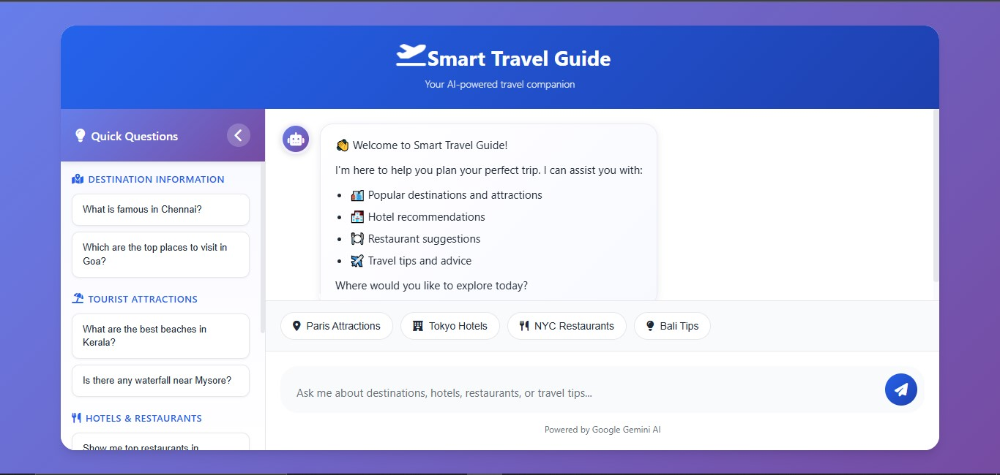

# ✈️ Smart Travel Guide Chatbot

## 🧠 Overview
**Smart Travel Guide** is an AI-powered travel assistant that helps users explore destinations, find hotels and restaurants, and get real-time travel insights.  
With an elegant and responsive design, this chatbot combines modern UI with an intuitive conversation experience — perfect for travel enthusiasts and planners.

---

## ✨ Features
- 💬 **AI-Powered Chat** – Ask travel-related questions and get instant responses.
- 🌍 **Destination Insights** – Discover top attractions, food spots, and hotels.
- 🧭 **Quick Suggestions Sidebar** – Predefined travel queries for instant access.
- 📱 **Responsive Design** – Optimized for mobile, tablet, and desktop.
- ⚙️ **Interactive UI** – Smooth animations, gradients, and dynamic chat interface.
- 🚀 **Powered by Gemini AI** – Smart, context-aware responses for better accuracy.

---

## 🧰 Tech Stack
- **Frontend:** HTML5, CSS3, JavaScript  
- **Icons & Fonts:** Font Awesome, Google Fonts  
- **AI Model:** Google Gemini API (integrated placeholder)  
- **Design:** Gradient themes, card-based layout, and micro-interactions

---

## 📂 Project Structure

